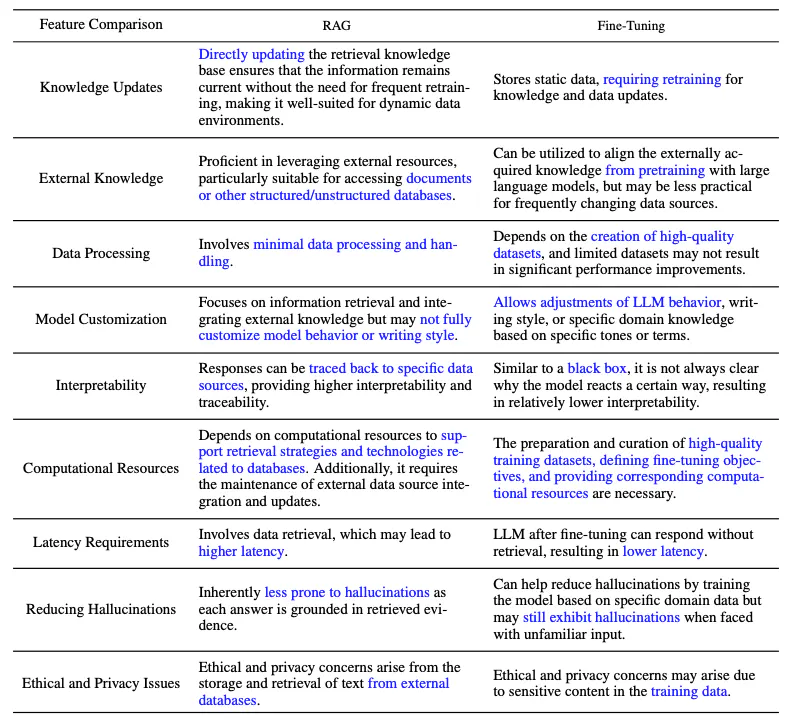
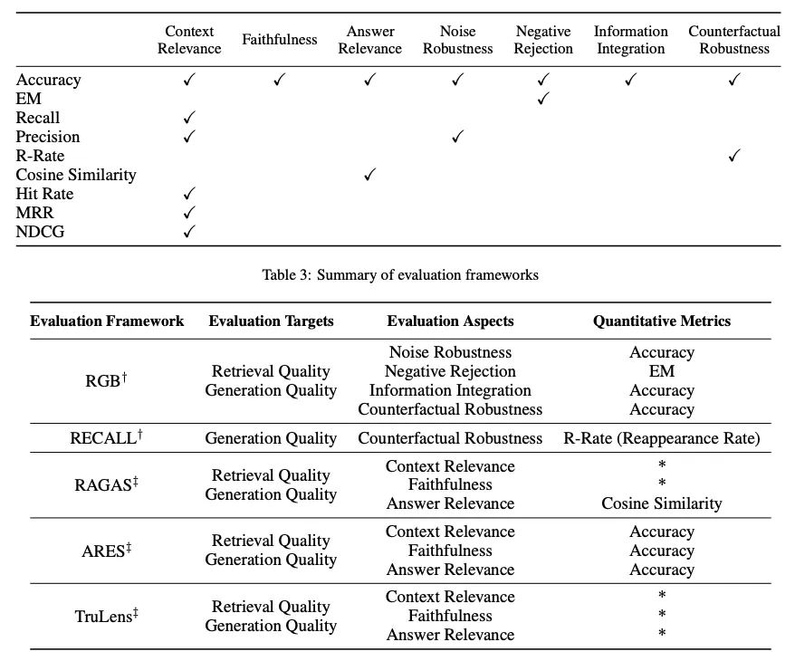

# Retrieval Augmented Generation (RAG) Cheatsheet

## Overview

- **RAG**: A solution to mitigate challenges in LLMs such as domain knowledge gaps, factuality issues, and hallucination by augmenting LLMs with external knowledge.
- **Use Cases**: Knowledge-intensive scenarios or domain-specific applications that require continually updating knowledge.
- **Advantage**: No need for retraining the LLM for task-specific applications.

## Key Findings from "Retrieval-Augmented Generation for Large Language Models: A Survey"

- **Focus Areas**: Existing approaches, state-of-the-art RAG, evaluation, applications, and technologies surrounding retrieval, generation, and augmentation techniques.

## Introduction to RAG

- **Definition**: RAG retrieves a set of relevant/supporting documents given a source (e.g., Wikipedia), concatenates them as context with the original input prompt, and feeds them to the text generator to produce the final output.
- **Benefits**: Enhances the accuracy, controllability, and relevancy of the LLM's response. Reduces issues of hallucination or performance when addressing problems in a highly evolving environment.

## Evolution of RAG

- **Current Approaches**: Combining the strengths of RAG and powerful fine-tuned models like ChatGPT and Mixtral.

## RAG Components

- **Input**: The question to which the LLM system responds. If no RAG is used, the LLM directly responds to the question.
- **Indexing**: If RAG is used, related documents are indexed by chunking them, generating embeddings of the chunks, and indexing them into a vector store. At inference, the query is also embedded similarly.
- **Retrieval**: Relevant documents are obtained by comparing the query against the indexed vectors, also denoted as "Relevant Documents".
- **Generation**: Relevant documents are combined with the original prompt as additional context. The combined text and prompt are then passed to the model for response generation, which is then prepared as the final output of the system to the user.

## RAG Paradigms

RAG systems have evolved from Naive RAG to Advanced RAG and Modular RAG to address certain limitations around performance, cost, and efficiency.

### Naive RAG

- **Process**: A user input is used to query relevant documents which are then combined with a prompt and passed to the model to generate a final response. Conversational history can be integrated into the prompt if the application involves multi-turn dialogue interactions.
- **Limitations**: Low precision (misaligned retrieved chunks), low recall (failure to retrieve all relevant chunks), outdated information passed to the LLM, hallucination issues, poor and inaccurate responses, redundancy and repetition when augmentation is applied, and over-dependence on the augmented information.

### Advanced RAG

Advanced RAG helps deal with issues present in Naive RAG by improving retrieval quality through optimizing the pre-retrieval, retrieval, and post-retrieval processes.

- **Pre-retrieval Optimization**: Enhancing data granularity, optimizing index structures, adding metadata, alignment optimization, and mixed retrieval.
- **Retrieval Optimization**: Fine-tuning the embedding to optimize retrieval relevance or employing dynamic embeddings that better capture contextual understanding (e.g., OpenAI’s embeddings-ada-02 model).
- **Post-retrieval Optimization**: Avoiding context window limits and dealing with noisy or potentially distracting information. Common approaches include re-ranking, relocation of relevant context to the edges of the prompt, recalculating the semantic similarity between the query and relevant text chunks, and prompt compression.

### Modular RAG

- **Definition**: Enhances functional modules such as incorporating a search module for similarity retrieval and applying fine-tuning in the retriever. Both Naive RAG and Advanced RAG are special cases of Modular RAG and are made up of fixed modules.
- **Extended RAG Modules**: Search, memory, fusion, routing, predict, and task adapter which solve different problems. These modules can be rearranged to suit specific problem contexts.
- **Benefits**: Greater diversity and flexibility in that you can add or replace modules or adjust the flow between modules based on task requirements.

### Optimization Techniques for RAG Pipelines

- **Hybrid Search Exploration**: Leverages a combination of search techniques like keyword-based search and semantic search to retrieve relevant and context-rich information.
- **Recursive Retrieval and Query Engine**: Involves a recursive retrieval process that might start with small semantic chunks and subsequently retrieve larger chunks that enrich the context.
- **StepBack-prompt**: A prompting technique that enables LLMs to perform abstraction that produces concepts and principles that guide reasoning.
- **Sub-Queries**: Different query strategies such as tree queries or sequential querying of chunks that can be used for different scenarios. LlamaIndex offers a sub question query engine that allows a query to be broken down into several questions that use different relevant data sources.
- **Hypothetical Document Embeddings (HyDE)**: Generates a hypothetical answer to a query, embeds it, and uses it to retrieve documents similar to the hypothetical answer as opposed to using the query directly.

## RAG Framework

In this section, we summarize the key developments of the components of a RAG system, which include Retrieval, Generation, and Augmentation.

### Retrieval

Retrieval is the component of RAG that deals with retrieving highly relevant context from a retriever. A retriever can be enhanced in many ways, including:

#### Enhancing Semantic Representations

- **Chunking**: Choosing the right chunking strategy depends on the content and the application. Different models perform better on varying block sizes.
- **Fine-tuned Embedding Models**: Fine-tuning the embedding model may be required if working with a specialized domain.

#### Aligning Queries and Documents

- **Query Rewriting**: Rewriting queries using a variety of techniques such as Query2Doc, ITER-RETGEN, and HyDE.
- **Embedding Transformation**: Optimizing the representation of query embeddings and aligning them to a latent space that is more closely aligned with a task.

#### Aligning Retriever and LLM

- **Fine-tuning Retrievers**: Using an LLM's feedback signals to refine the retrieval models.
- **Adapters**: Incorporating external adapters to help with the alignment process.

### Generation

The generator in a RAG system is responsible for converting retrieved information into a coherent text that will form the final output of the model. This process involves diverse input data which sometimes require efforts to refine the adaptation of the language model to the input data derived from queries and documents. This can be addressed using post-retrieval process and fine-tuning:

- **Post-retrieval with Frozen LLM**: Post-retrieval processing leaves the LLM untouched and instead focuses on enhancing the quality of retrieval results through operations like information compression and result reranking.
- **Fine-tuning LLM for RAG**: To improve the RAG system, the generator can be further optimized or fine-tuned to ensure that the generated text is natural and effectively leverages the retrieved documents.

### Augmentation

Augmentation involves the process of effectively integrating context from retrieved passages with the current generation task. Before discussing more on the augmentation process, augmentation stages, and augmentation data, here is a taxonomy of RAG's core components:

### Retrieval Augmentation

- **Stages**: Can be applied in pre-training, fine-tuning, and inference stages.
- **RETRO**: An example of a system that leverages retrieval augmentation for large-scale pre-training from scratch.

### Augmentation Stages

- **Pre-training**: RETRO uses an additional encoder built on top of external knowledge.
- **Fine-tuning**: Can be combined with RAG to help develop and improve the effectiveness of RAG systems.
- **Inference**: Many techniques are applied to effectively incorporate retrieved content to meet specific task demands and further refine the RAG process.

### Augmentation Source

- **Data Categories**: Unstructured, structured, and LLM-generated data.

### Augmentation Process

- **Iterative Retrieval**: Enables the model to perform multiple retrieval cycles to enhance the depth and relevance of information. Notable approaches include RETRO and GAR-meets-RAG.
- **Recursive Retrieval**: Recursively iterates on the output of one retrieval step as the input to another retrieval step. Notable approaches include IRCoT and Tree of Clarifications.
- **Adaptive Retrieval**: Tailors the retrieval process to specific demands by determining optimal moments and content for retrieval. Notable approaches include FLARE and Self-RAG.

## RAG vs. Fine-tuning

- **RAG**: Useful for integrating new knowledge.
- **Fine-tuning**: Can be used to improve model performance and efficiency through improving internal knowledge, output format, and teaching complex instruction following.
- **Prompting Engineering**: Can also help to optimize results by leveraging the inherent capabilities of the model.

## RAG Evaluation

- **Role**: Plays a key role in understanding and optimizing the performance of RAG models across diverse application scenarios.
- **Targets**: Determined for both retrieval and generation where the goal is to evaluate both the quality of the context retrieved and the quality of the content generated.
- **Retrieval Quality Metrics**: Metrics used in other knowledge-intensive domains like recommendation systems and information retrieval are used such as NDCG and Hit Rate.
- **Generation Quality Metrics**: Different aspects like relevance and harmfulness if it's unlabeled content or accuracy for labeled content.
- **Evaluation Methods**: Can involve either manual or automatic evaluation methods.

## Evaluating a RAG Framework

- **Quality Scores**: Measuring context relevance, answer faithfulness, and answer relevance.
- **Abilities**: Noise robustness, negative rejection, information integration, and counterfactual robustness.

## Challenges & Future of RAG

- **Context Length**: LLMs continue to extend context window size which presents challenges to how RAG needs to be adapted to ensure highly relevant and important context is captured.
- **Robustness**: Dealing with counterfactual and adversarial information is important to measure and improve in RAG.
- **Hybrid Approaches**: There is an ongoing research effort to better understand how to best optimize the use of both RAG and fine-tuned models.
- **Expanding LLM Roles**: Increasing the role and capabilities of LLMs to further enhance RAG systems is of high interest.
- **Scaling Laws**: Investigation of LLM scaling laws and how they apply to RAG systems are still not properly understood.
- **Production-ready RAG**: Production-grade RAG systems demand engineering excellence across performance, efficiency, data security, privacy, and more.
- **Multimodal RAG**: There is increasing interest in extending modalities for a RAG system to support tackling problems in more domains such as image, audio and video, code, and more.
- **Evaluation**: The interest in building complex applications with RAG requires special attention to develop nuanced metrics and assessment tools that can more reliably assess different aspects such as contextual relevance, creativity, content diversity, factuality, and more. In addition, there is also a need for better interpretability research and tools for RAG.
